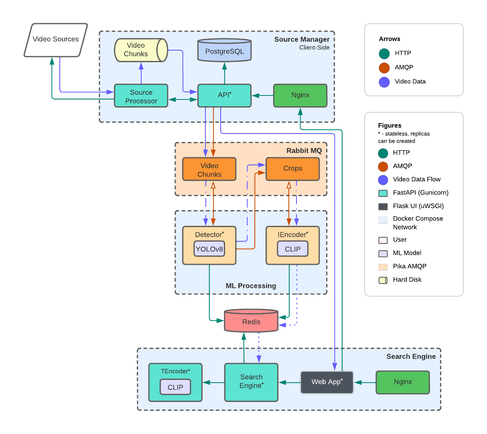
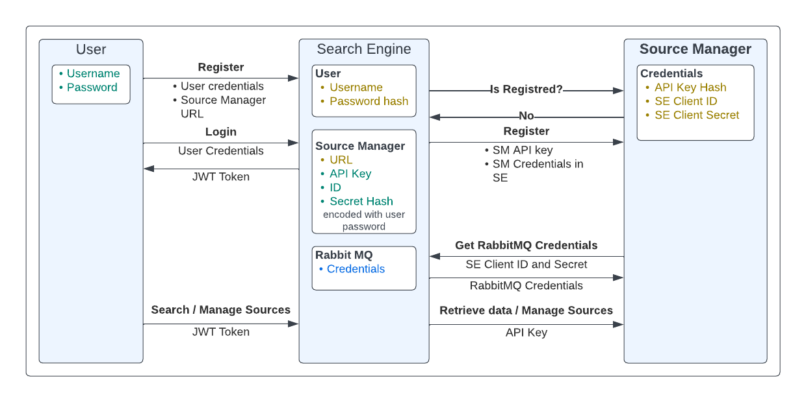

# Security Video Retrieval
Security Video Retrieval (SVR) is a project that aims to create a natural language interface for searching security camera footage. The project is currently in its early stages, and is not yet ready for use.

## Table of Contents
- [Architecture](#architecture)
- [Video Data Flow](#video-data-flow)
- [Security](#security)
- [Deployment](#deployment)
- [Demo](#demo)
- [Additional Information](#additional-information)

## Architecture
The project can be divided into 3 main components:
- **Search Engine** - main component of the system. It is a web application that provides a natural language interface for searching security camera footage. It also provides a web interface for source management.
- **Source Manager** - client-side application that manages the security camera sources, captures video, stores it, and sends it to the server for processing. The source manager is more of a dummy application, that simulates the security camera sources. Each user hosts their own source manager and links it to their profile on the search engine web application.
- **ML Processor** - group of stateless services that process the video data. The ML processor can be easily scaled horizontally and vertically.

SVR also uses Redis and RabbitMQ for storing and queuing data. Their configuration files are stored in this repository.

Each component is a separate dockerized application stored in its own submodule and can be deployed on a separate machine. The components communicate with each other using REST APIs. The architecture of the system is shown in the following diagram:

*You can read more about components and their deployment in their respective README files.*

## Video Data Flow
Video data processing is done in the following steps:
- **Video Capture** - video is captured by the source manager and sent in chunks to the RabbitMQ queue.
- **Detection** - video chunks are consumed from the RabbitMQ queue by the detection service. The detection service uses YOLOv8 to detect objects in the video chunks. Detected objects are cropped from the video chunks and sent to the RabbitMQ queue.
- **Vectorization** - video chunks are consumed from the RabbitMQ queue by the encoder service. The encoder service uses CLIP to embed the video chunks into vectors. The vectors are stored in Redis.
- **Search** - closest vectors to the query vector are retrieved from Redis and the corresponding frames are retrieved from the source manager.

## Security
After user deploys the source manager, they just need to create an account on the search engine web application and pass the URL of their source manager during the registration process. The source manager will be automatically registered on the search engine web application. After that, source manager will can only be accessed through the search engine web application.

After registration, source manager can retrieve RabbitMQ credentials from the search engine web application and start sending video data to the RabbitMQ queue. Now there is only one set of rabbitmq credentials for all source managers, but in the future, each source manager will have its own set of credentials, so
they can be easily revoked.

## Deployment
All components are dockerized and can be deployed using docker-compose.

Deployment process is described in the README files of each component.

Recommended deployment order:
1. [RabbitMQ](rabbitmq/README.md)
2. [Redis](redis/README.md)
3. [Search Engine](https://github.com/TLMOS/svr_search_engine)
4. [ML Processor](https://github.com/TLMOS/svr_ml_processing)
5. [Monitoring](monitoring/README.md)
6. [Source Manager](https://github.com/TLMOS/svr_source_manager)

## Demo
Demo version of the project is available at [svr.tlmos.tech](https://svr.tlmos.tech). It has limited amount of resources, so be patient if it doesn't work.

Guest username: `source_manager_1`
Guest password: `11111111`

You can also create your own account and deploy your own source manager. You can find deployment instructions in the README file of source manager repository.

## Additional Information
This project was created as a part of my final year project at the Avito Analytics Academy.

Folder `info` contains information about the project in a format required by the Avito Analytics Academy.